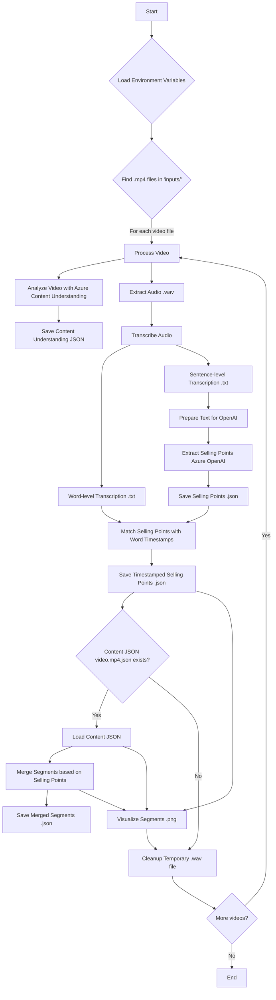

# Video Speech Transcription and Analysis

This repository contains tools for transcribing speech from video files using Azure Speech-to-Text service, extracting selling points using Azure OpenAI, and analyzing timestamp data.

## Requirements

- Python 3.6+
- FFmpeg installed and available in PATH
- Azure Speech Service subscription (key and endpoint)
- Azure OpenAI Service subscription (API key, endpoint, API version, deployment name)
- Azure Content Understanding Service subscription (API key, endpoint, API version)
- Node.js and npm (for running the frontend visualization)

## Setup

1. Install required dependencies:
   ```zsh
   pip install -r requirements.txt
   ```

2. Set up your environment variables:
   - Copy the template to create your own `.env` file:
     ```zsh
     cp .env.example .env
     ```
   - Open the `.env` file and replace all placeholder values with your actual Azure service credentials:
     ```
     # Azure Speech Service
     AZURE_SPEECH_KEY=your_actual_speech_key
     AZURE_SPEECH_ENDPOINT=your_actual_speech_endpoint
     
     # Azure OpenAI Service
     AZURE_OPENAI_API_KEY=your_actual_openai_key
     AZURE_OPENAI_API_VERSION=your_actual_openai_api_version
     AZURE_OPENAI_ENDPOINT=your_actual_openai_endpoint
     AZURE_OPENAI_DEPLOYMENT=your_actual_openai_deployment_name
     
     # Azure Content Understanding Service
     AZURE_CONTENT_UNDERSTANDING_ENDPOINT=your_content_understanding_endpoint_here
     AZURE_CONTENT_UNDERSTANDING_API_VERSION=your_content_understanding_api_version_here
     AZURE_CONTENT_UNDERSTANDING_API_KEY=your_content_understanding_api_key_here
     ```
   - Each variable has comments in the `.env.example` file explaining what it's for and where to find it

3. Install frontend dependencies:
   ```zsh
   cd frontend
   npm install
   ```

## Backend Logic Overview



## Using the Video Processing Tool (`app.py`)

The `app.py` script processes `.mp4` video files in the `inputs/` directory, performs transcription, extracts selling points, matches them with timestamps, merges segments, and generates visualizations.

### Features:
- Extracts audio from video using FFmpeg
- Transcribes using Azure Speech-to-Text service
- Generates both word-level and sentence-level transcriptions with accurate timestamps
- Extracts selling points from transcriptions using Azure OpenAI
- Matches extracted selling points with word-level timestamps
- Merges video segments based on selling point timestamps (requires a `video_name.mp4.json` file in `inputs/` with initial segment data)
- Visualizes original segments, selling points, and merged segments

### Running the tool:

```zsh
python app.py
```

### Output:

For each video file (e.g., `inputs/example.mp4`), the script produces:
- `inputs/example.wav`: Temporary audio file (deleted after processing)
- `inputs/example_word.txt`: Word-level transcription with timestamps
- `inputs/example_sentence.txt`: Sentence-level transcription with timestamps
- `inputs/example_selling_points.json`: Extracted selling points with matched timestamps
- `inputs/example_merged_segments.json`: Merged video segments based on selling points (if `inputs/example.mp4.json` exists)
- `inputs/example_segments_visualization.png`: Visualization of segments, selling points, and merging process (if segment merging occurs)

Example `_word.txt` / `_sentence.txt` format:
```
[0.07 - 0.67] text_segment
[0.70 - 1.30] another_text_segment
...
```

Example `_selling_points.json` format:
```json
{
  "selling_points": [
    {
      "startTime": 10.5,
      "endTime": 12.3,
      "content": "This is a selling point"
    },
    // ... more selling points
  ]
}
```

## Frontend Visualization Tool

The repository includes an interactive web-based visualization tool to review and analyze video segments.

### Features:
- Interactive timeline visualization of video segments
- Video player synchronized with segment timeline
- Color-coded segments for different types (merged, unmerged, selling point, final)
- Real-time current time marker with timestamp display
- Segment details display when selecting segments
- Support for uploading and analyzing your own videos and segment files

### Running the frontend:

```zsh
cd frontend
npm start
```

Then open your browser and navigate to `http://localhost:3000`

### Using the visualization tool:

1. Select a video file using the "Select Video File" button
2. Select the corresponding JSON segments file using the "Select Segments JSON File" button
3. The video will load and the timeline will display all segment types
4. Click on any segment to view its details in the "Segment Details" section
5. Play the video to see the current time marker move across the timeline
6. The timeline shows different segment types in different colors (see legend)

## Workflow Example

1. Place your `.mp4` video files in the `inputs/` directory.
2. (Optional) If you want to use the segment merging feature, place a corresponding `video_name.mp4.json` file (containing initial video segment data) for each video in the `inputs/` directory.
3. Run the processing tool:
   ```zsh
   python app.py
   ```
4. Examine the generated transcript files (`_word.txt`, `_sentence.txt`), selling points (`_selling_points.json`), merged segments (`_merged_segments.json`), and visualizations (`_segments_visualization.png`) in the `inputs/` directory.
5. Start the frontend visualization server:
   ```zsh
   cd frontend
   npm start
   ```
6. Open `http://localhost:3000` in your browser and upload your video and the corresponding `_merged_segments.json` file to interactively explore the segments.

## Troubleshooting

- **FFmpeg not found**: Ensure FFmpeg is installed and added to your PATH.
- **Azure credentials error**: Verify your `.env` file contains valid credentials for both Azure Speech and Azure OpenAI services.
- **No transcriptions generated**: Check Azure Speech Service subscription status and network connectivity.
- **Selling point extraction issues**: Verify Azure OpenAI credentials, deployment name, and service status. Check logs for errors from the OpenAI API.
- **Segment merging not working**: Ensure a correctly formatted `video_name.mp4.json` file exists in the `inputs/` directory for the respective video.
- **Frontend not loading**: Check that you've installed the npm dependencies and that the server is running correctly.
- **Segments not displaying in frontend**: Verify that the JSON file has the correct format with `merged_segments`, `unmerged_segments`, and `final_segments` arrays.

## File Structure

```
├── .env                       # Azure service credentials
├── requirements.txt           # Python dependencies
├── app.py                     # Main video processing script
├── transcribe_videos.py       # Module for transcription functions (imported by app.py)
├── README.md                  # This documentation
├── frontend/                  # Frontend visualization tool
│   ├── index.html             # Main HTML page
│   ├── styles.css             # CSS styles
│   ├── app.js                 # Frontend JavaScript
│   ├── server.js              # Express server for serving the frontend
│   └── package.json           # Node.js dependencies
├── inputs/                    # Directory for input videos and generated files
│   ├── *.mp4                  # Input video files
│   ├── *.mp4.json             # (Optional) Input JSON for initial video segments
│   ├── *_word.txt             # Generated word-level transcripts
│   ├── *_sentence.txt         # Generated sentence-level transcripts
│   ├── *_selling_points.json  # Generated selling points with timestamps
│   ├── *_merged_segments.json # Generated merged segments
│   └── *_segments_visualization.png # Generated segment visualization
└── outputs/                   # (Potentially unused or for other scripts, app.py outputs to inputs/)
```

## Contributing

Feel free to submit issues or pull requests with improvements or bug fixes.
