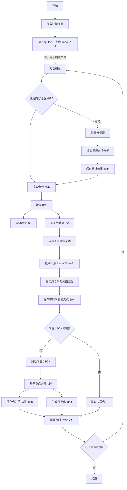

# 视频语音转录和分析

本仓库包含使用 Azure 语音转文本服务从视频文件中转录语音、使用 Azure OpenAI 提取卖点以及分析时间戳数据的工具。

## 要求

- Python 3.6+
- FFmpeg 已安装并在 PATH 中可用
- Azure 语音服务订阅（密钥和端点）
- Azure OpenAI 服务订阅（API 密钥、端点、API 版本、部署名称）
- Azure 内容理解服务订阅（API 密钥、端点、API 版本）
- Node.js 和 npm（用于运行前端可视化）

## 设置

1. 安装所需依赖项：
   ```zsh
   pip install -r requirements.txt
   ```

2. 设置环境变量：
   - 复制模板以创建您自己的 `.env` 文件：
     ```zsh
     cp .env.example .env
     ```
   - 打开 `.env` 文件并将所有占位符值替换为您的实际 Azure 服务凭据：
     ```
     # Azure 语音服务
     AZURE_SPEECH_KEY=您的实际语音密钥
     AZURE_SPEECH_ENDPOINT=您的实际语音端点
     
     # Azure OpenAI 服务
     AZURE_OPENAI_API_KEY=您的实际openai密钥
     AZURE_OPENAI_API_VERSION=您的实际openai_api版本
     AZURE_OPENAI_ENDPOINT=您的实际openai端点
     AZURE_OPENAI_DEPLOYMENT=您的实际openai部署名称
     
     # Azure 内容理解服务
     AZURE_CONTENT_UNDERSTANDING_ENDPOINT=您的内容理解端点
     AZURE_CONTENT_UNDERSTANDING_API_VERSION=您的内容理解api版本
     AZURE_CONTENT_UNDERSTANDING_API_KEY=您的内容理解api密钥
     ```
   - 每个变量在 `.env.example` 文件中都有注释说明其用途和查找位置

3. 安装前端依赖项：
   ```zsh
   cd frontend
   npm install
   ```

## 后端逻辑概览



## 使用视频处理工具 (`app.py`)

`app.py` 脚本处理 `inputs/` 目录中的 `.mp4` 视频文件，执行转录，提取卖点，将它们与时间戳匹配，合并片段，并生成可视化。

### 功能：
- 使用 FFmpeg 从视频中提取音频
- 使用 Azure 语音转文本服务进行转录
- 生成具有准确时间戳的词级和句子级转录
- 使用 Azure OpenAI 从转录中提取卖点
- 将提取的卖点与词级时间戳匹配
- 基于卖点时间戳合并视频片段（需要在 `inputs/` 中有一个包含初始片段数据的 `video_name.mp4.json` 文件）
- 可视化原始片段、卖点和合并的片段

### 运行工具：

```zsh
python app.py
```

### 输出：

对于每个视频文件（例如 `inputs/example.mp4`），脚本会生成：
- `inputs/example.wav`：临时音频文件（处理后删除）
- `inputs/example_word.txt`：带时间戳的词级转录
- `inputs/example_sentence.txt`：带时间戳的句子级转录
- `inputs/example_selling_points.json`：带匹配时间戳的提取卖点
- `inputs/example_merged_segments.json`：基于卖点的合并视频片段（如果 `inputs/example.mp4.json` 存在）
- `inputs/example_segments_visualization.png`：片段、卖点和合并过程的可视化（如果发生片段合并）

示例 `_word.txt` / `_sentence.txt` 格式：
```
[0.07 - 0.67] 文本片段
[0.70 - 1.30] 另一个文本片段
...
```

示例 `_selling_points.json` 格式：
```json
{
  "selling_points": [
    {
      "startTime": 10.5,
      "endTime": 12.3,
      "content": "这是一个卖点"
    },
    // ... 更多卖点
  ]
}
```

## 前端可视化工具

该仓库包含一个交互式的基于网页的可视化工具，用于查看和分析视频片段。

### 功能：
- 视频片段的交互式时间轴可视化
- 与片段时间轴同步的视频播放器
- 不同类型的颜色编码片段（合并、未合并、卖点、最终）
- 带时间戳显示的实时当前时间标记
- 选择片段时显示片段详情
- 支持上传和分析您自己的视频和片段文件

### 运行前端：

```zsh
cd frontend
npm start
```

然后打开浏览器并导航到 `http://localhost:3000`

### 使用可视化工具：

1. 使用"选择视频文件"按钮选择视频文件
2. 使用"选择片段 JSON 文件"按钮选择相应的 JSON 片段文件
3. 视频将加载，时间轴将显示所有片段类型
4. 点击任何片段以在"片段详情"部分查看其详细信息
5. 播放视频以查看当前时间标记在时间轴上移动
6. 时间轴显示不同颜色的不同片段类型（参见图例）

## 工作流程示例

1. 将您的 `.mp4` 视频文件放在 `inputs/` 目录中。
2. （可选）如果您想使用片段合并功能，请为 `inputs/` 目录中的每个视频放置相应的 `video_name.mp4.json` 文件（包含初始视频片段数据）。
3. 运行处理工具：
   ```zsh
   python app.py
   ```
4. 检查 `inputs/` 目录中生成的转录文件（`_word.txt`、`_sentence.txt`）、卖点（`_selling_points.json`）、合并的片段（`_merged_segments.json`）和可视化（`_segments_visualization.png`）。
5. 启动前端可视化服务器：
   ```zsh
   cd frontend
   npm start
   ```
6. 在浏览器中打开 `http://localhost:3000` 并上传您的视频和相应的 `_merged_segments.json` 文件以交互式地探索片段。

## 故障排除

- **找不到 FFmpeg**：确保 FFmpeg 已安装并添加到您的 PATH 中。
- **Azure 凭据错误**：验证您的 `.env` 文件包含 Azure 语音和 Azure OpenAI 服务的有效凭据。
- **未生成转录**：检查 Azure 语音服务订阅状态和网络连接。
- **卖点提取问题**：验证 Azure OpenAI 凭据、部署名称和服务状态。检查日志中来自 OpenAI API 的错误。
- **片段合并不起作用**：确保 `inputs/` 目录中存在相应视频的格式正确的 `video_name.mp4.json` 文件。
- **前端未加载**：检查您是否已安装 npm 依赖项并且服务器正在正确运行。
- **前端中不显示片段**：验证 JSON 文件具有包含 `merged_segments`、`unmerged_segments` 和 `final_segments` 数组的正确格式。

## 文件结构

```
├── .env                       # Azure 服务凭据
├── requirements.txt           # Python 依赖项
├── app.py                     # 主视频处理脚本
├── transcribe_videos.py       # 转录功能模块（由 app.py 导入）
├── content_understanding_client.py  # Azure 内容理解客户端
├── analyzer_templates/        # 分析器模板
│   └── video_content_understanding.json  # 视频内容理解模板
├── README.md                  # 英文文档
├── README_zh.md               # 中文文档
├── frontend/                  # 前端可视化工具
│   ├── index.html             # 主 HTML 页面
│   ├── styles.css             # CSS 样式
│   ├── app.js                 # 前端 JavaScript
│   ├── server.js              # 用于提供前端服务的 Express 服务器
│   └── package.json           # Node.js 依赖项
├── inputs/                    # 输入视频和生成文件的目录
│   ├── *.mp4                  # 输入视频文件
│   ├── *.mp4.json             # （可选）初始视频片段的输入 JSON
│   ├── *_word.txt             # 生成的词级转录
│   ├── *_sentence.txt         # 生成的句子级转录
│   ├── *_selling_points.json  # 带时间戳的生成卖点
│   ├── *_merged_segments.json # 生成的合并片段
│   └── *_segments_visualization.png # 生成的片段可视化
└── outputs/                   # （可能未使用或用于其他脚本，app.py 输出到 inputs/）
```

## 贡献

欢迎提交问题或带有改进或错误修复的拉取请求。
