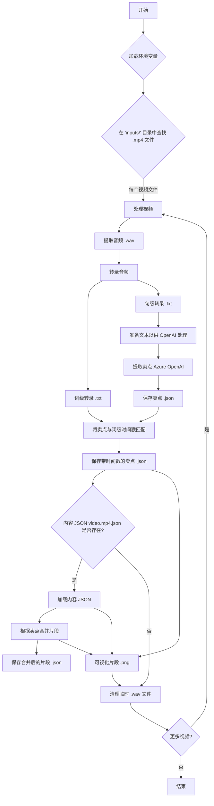

# 视频语音转录与分析

本代码库包含使用 Azure 语音转文本服务转录视频文件中的语音，使用 Azure OpenAI 提取卖点，并分析时间戳数据的工具。

## 系统需求

- Python 3.6+
- FFmpeg 已安装并在系统路径 (PATH) 中可用
- Azure 语音服务订阅（密钥和终结点）
- Azure OpenAI 服务订阅（API 密钥、终结点、API 版本、部署名称）

## 安装设置

1. 安装所需的依赖包：
   ```zsh
   pip install -r requirements.txt
   ```

2. 在项目根目录创建一个 `.env` 文件，并填入您的 Azure 语音服务和 Azure OpenAI 服务凭据：
   ```
   AZURE_SPEECH_KEY=your_azure_speech_key_here
   AZURE_SPEECH_ENDPOINT=your_azure_speech_endpoint_here
   AZURE_OPENAI_API_KEY=your_azure_openai_api_key_here
   AZURE_OPENAI_API_VERSION=your_azure_openai_api_version_here
   AZURE_OPENAI_ENDPOINT=your_azure_openai_endpoint_here
   AZURE_OPENAI_DEPLOYMENT=your_azure_openai_deployment_name_here
   ```

## 后端逻辑概览



## 使用视频处理工具 (`app.py`)

`app.py` 脚本处理 `inputs/` 目录中的 `.mp4` 视频文件，执行转录、提取卖点、将其与时间戳匹配、合并片段并生成可视化结果。

### 功能特性:
- 使用 FFmpeg 从视频中提取音频
- 使用 Azure 语音转文本服务进行转录
- 生成词级和句级转录，并带有准确的时间戳
- 使用 Azure OpenAI 从转录中提取卖点
- 将提取的卖点与词级时间戳匹配
- 根据卖点时间戳合并视频片段（需要在 `inputs/` 目录中提供一个 `video_name.mp4.json` 文件，其中包含初始片段数据）
- 可视化原始片段、卖点和合并后的片段

### 运行工具:

```zsh
python app.py
```

### 输出:

对于每个视频文件（例如 `inputs/example.mp4`），脚本会生成：
- `inputs/example.wav`: 临时音频文件（处理后删除）
- `inputs/example_word.txt`: 带时间戳的词级转录
- `inputs/example_sentence.txt`: 带时间戳的句级转录
- `inputs/example_selling_points.json`: 提取的带匹配时间戳的卖点
- `inputs/example_merged_segments.json`: 根据卖点合并的视频片段（如果 `inputs/example.mp4.json` 存在）
- `inputs/example_segments_visualization.png`: 片段、卖点和合并过程的可视化（如果发生片段合并）

`_word.txt` / `_sentence.txt` 格式示例:
```
[0.07 - 0.67] 文本片段
[0.70 - 1.30] 另一个文本片段
...
```

`_selling_points.json` 格式示例:
```json
{
  "selling_points": [
    {
      "startTime": 10.5,
      "endTime": 12.3,
      "content": "这是一个卖点"
    },
    // ... 更多卖点
  ]
}
```

## 工作流程示例

1. 将您的 `.mp4` 视频文件放入 `inputs/` 目录。
2. （可选）如果您想使用片段合并功能，请为每个视频在 `inputs/` 目录中放置一个相应的 `video_name.mp4.json` 文件（包含初始视频片段数据）。
3. 运行处理工具：
   ```zsh
   python app.py
   ```
4. 检查 `inputs/` 目录中生成的转录文件（`_word.txt`, `_sentence.txt`）、卖点文件（`_selling_points.json`）、合并后的片段文件（`_merged_segments.json`）和可视化文件（`_segments_visualization.png`）。

## 故障排除

- **未找到 FFmpeg**: 确保 FFmpeg 已安装并添加到系统路径 (PATH)。
- **Azure 凭据错误**: 验证您的 `.env` 文件是否包含 Azure 语音服务和 Azure OpenAI 服务的有效凭据。
- **未生成转录**: 检查 Azure 语音服务订阅状态和网络连接。
- **卖点提取问题**: 验证 Azure OpenAI 凭据、部署名称和服务状态。检查 OpenAI API 返回的错误日志。
- **片段合并失败**: 确保 `inputs/` 目录中存在针对相应视频的格式正确的 `video_name.mp4.json` 文件。

## 文件结构

```
├── .env                       # Azure 服务凭据
├── requirements.txt           # Python 依赖包
├── app.py                     # 主要视频处理脚本
├── transcribe_videos.py       # 转录功能模块 (由 app.py 导入)
├── README.md                  # 本文档 (英文版)
├── README_zh.md               # 本文档 (中文版)
├── inputs/                    # 输入视频和生成文件的目录
│   ├── *.mp4                  # 输入视频文件
│   ├── *.mp4.json             # (可选) 初始视频片段的输入 JSON 文件
│   ├── *_word.txt             # 生成的词级转录
│   ├── *_sentence.txt         # 生成的句级转录
│   ├── *_selling_points.json  # 生成的带时间戳的卖点
│   ├── *_merged_segments.json # 生成的合并片段
│   └── *_segments_visualization.png # 生成的片段可视化图像
└── outputs/                   # (可能未使用或用于其他脚本, app.py 的输出在 inputs/ 目录)
```

## 贡献

欢迎提交问题 (issues) 或拉取请求 (pull requests) 以改进或修复错误。
