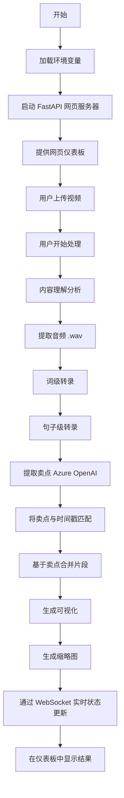

# 视频语音转录和分析

本仓库包含使用 Azure 语音转文本服务从视频文件中转录语音、使用 Azure OpenAI 提取卖点以及通过现代化网页仪表板分析时间戳数据的工具。

## 要求

- Python 3.9+
- FFmpeg 已安装并在 PATH 中可用
- Azure 语音服务订阅（密钥和端点）
- Azure OpenAI 服务订阅（API 密钥、端点、API 版本、部署名称）
- Azure 内容理解服务订阅（API 密钥、端点、API 版本）

## 设置

1. 安装所需依赖项：
   ```bash
   pip install -r requirements.txt
   ```

2. 设置环境变量：
   - 复制模板以创建您自己的 `.env` 文件：
     ```bash
     cp .env.example .env
     ```
   - 打开 `.env` 文件并将所有占位符值替换为您的实际 Azure 服务凭据：
     ```
     # Azure 语音服务
     AZURE_SPEECH_KEY=您的实际语音密钥
     AZURE_SPEECH_ENDPOINT=您的实际语音端点
     
     # Azure OpenAI 服务
     AZURE_OPENAI_API_KEY=您的实际openai密钥
     AZURE_OPENAI_API_VERSION=您的实际openai_api版本
     AZURE_OPENAI_ENDPOINT=您的实际openai端点
     AZURE_OPENAI_DEPLOYMENT=您的实际openai部署名称
     
     # Azure 内容理解服务
     AZURE_CONTENT_UNDERSTANDING_ENDPOINT=您的内容理解端点
     AZURE_CONTENT_UNDERSTANDING_API_VERSION=您的内容理解api版本
     AZURE_CONTENT_UNDERSTANDING_API_KEY=您的内容理解api密钥
     ```

## 后端逻辑概览



## 视频分析网页仪表板

该应用程序提供基于 FastAPI 构建的现代化网页仪表板，允许您通过直观的界面上传、处理和分析视频。

### 功能特色：
- **拖放视频上传**：通过网页界面直接上传视频
- **实时处理更新**：通过 WebSocket 连接实时进度更新
- **批量处理**：选择并同时处理多个视频
- **交互式结果查看器**：
  - 带同步时间轴的视频播放器
  - 可点击的片段可视化
  - 卖点分析
  - 内容理解结果
- **内容理解**：使用 Azure AI 自动视频内容分析
- **响应式设计**：现代化微软 Fluent UI 设计系统
- **视频缩略图**：为所有视频自动生成缩略图

### 运行网页仪表板：

```bash
python app.py
```

网页仪表板将在 `http://localhost:8000` 可用

### 使用仪表板：

1. **上传视频**：
   - 将视频文件拖放到上传区域，或点击浏览
   - 支持格式：MP4、AVI、MOV、MKV、WebM
   - 文件自动保存到 `inputs/` 目录

2. **处理视频**：
   - 使用复选框选择视频
   - 点击"处理选定"开始批量处理
   - 监控实时进度更新
   - 内容理解始终启用以进行全面分析

3. **查看结果**：
   - 点击已完成视频上的"结果"按钮
   - 带片段时间轴的交互式视频播放器
   - 点击片段跳转到特定时间戳
   - 查看带时间戳的卖点
   - 分析合并和未合并片段

### 批处理模式（命令行）：

无需网页界面的自动化处理：

```bash
python app.py --batch
```

这将自动处理 `inputs/` 目录中的所有视频。

### API 端点：

应用程序提供完整的 REST API：
- `GET /api/videos` - 列出所有视频
- `POST /api/upload` - 上传视频文件
- `POST /api/process` - 处理单个视频
- `POST /api/process-batch` - 处理多个视频
- `GET /api/results/{video_name}` - 获取处理结果
- `GET /api/status/{video_name}` - 获取处理状态
- `DELETE /api/videos/{video_name}` - 删除视频和结果
- `WebSocket /ws` - 实时更新

## 输出文件

对于每个处理的视频（例如 `example.mp4`），系统生成：
- `example_word.txt`：带时间戳的词级转录
- `example_sentence.txt`：带时间戳的句子级转录
- `example_selling_points.json`：带匹配时间戳的提取卖点
- `example_merged_segments.json`：基于卖点的合并视频片段
- `example_segments_visualization.png`：所有片段的可视化时间轴
- `example.mp4.json`：Content Understanding分析结果
- `thumbnails/example.jpg`：视频缩略图

示例格式：

**词/句子转录：**
```
[0.07 - 0.67] 文本片段
[0.70 - 1.30] 另一个文本片段
```

**卖点 JSON：**
```json
{
  "selling_points": [
    {
      "startTime": 10.5,
      "endTime": 12.3,
      "content": "这是一个卖点"
    }
  ]
}
```

## 配置选项

### 命令行参数：
- `--batch`：在无网页界面的批处理模式下运行
- `--host`：绑定网页服务器的主机（默认：0.0.0.0）
- `--port`：网页服务器端口（默认：8000）

### 环境变量：
所有 Azure 服务凭据必须在 `.env` 文件中配置，如设置部分所示。

## 故障排除

- **找不到 FFmpeg**：确保 FFmpeg 已安装并添加到您的 PATH 中
- **Azure 凭据错误**：验证您的 `.env` 文件包含所有 Azure 服务的有效Key
- **上传失败**：检查文件格式是否受支持且文件大小合理
- **缩略图未生成**：验证 FFmpeg 安装和视频文件完整性

## 文件结构

```
├── .env                       # Azure 服务凭据
├── requirements.txt           # Python 依赖项
├── app.py                     # 主 FastAPI 应用程序
├── transcribe_videos.py       # 转录功能模块
├── content_understanding_client.py  # Azure 内容理解客户端
├── analyzer_templates/        # 内容理解模板
│   └── video_content_understanding.json
├── static/                    # 网页仪表板文件
│   └── index.html            # 主网页界面
├── inputs/                    # 视频文件和处理结果
│   ├── *.mp4                 # 输入视频文件
│   ├── *_word.txt            # 词级转录
│   ├── *_sentence.txt        # 句子级转录
│   ├── *_selling_points.json # 带时间戳的卖点
│   ├── *_merged_segments.json # 合并片段
│   ├── *_segments_visualization.png # 可视化时间轴
│   └── *.mp4.json           # 内容理解结果
├── thumbnails/               # 生成的视频缩略图
│   └── *.jpg
├── README.md                 # 英文文档
└── README_zh.md              # 中文文档
```

## 贡献

欢迎提交问题或带有改进或错误修复的拉取请求。
